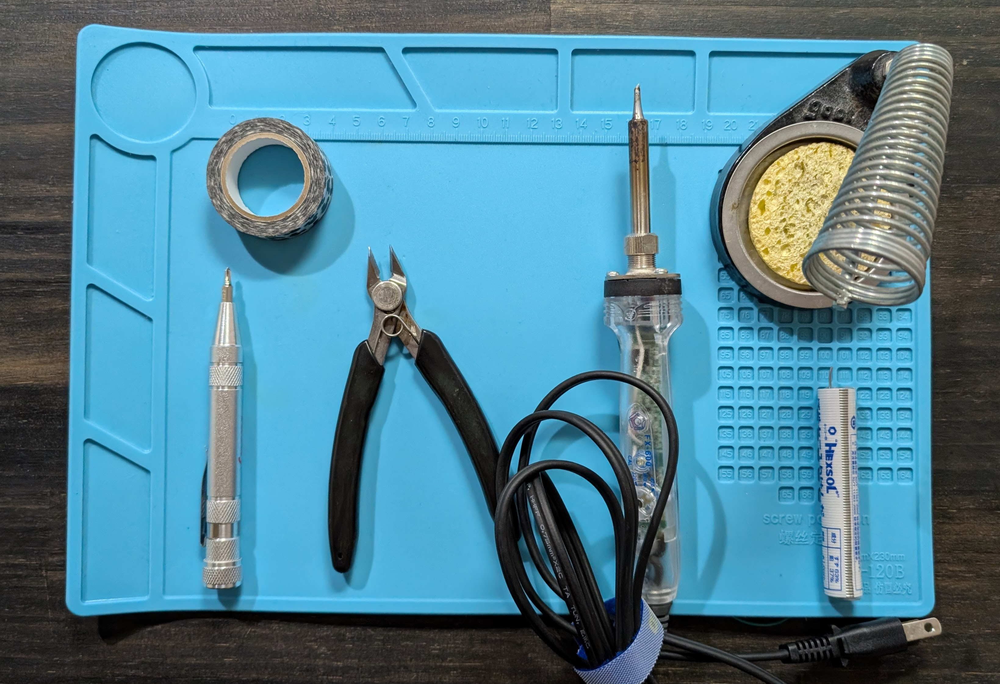
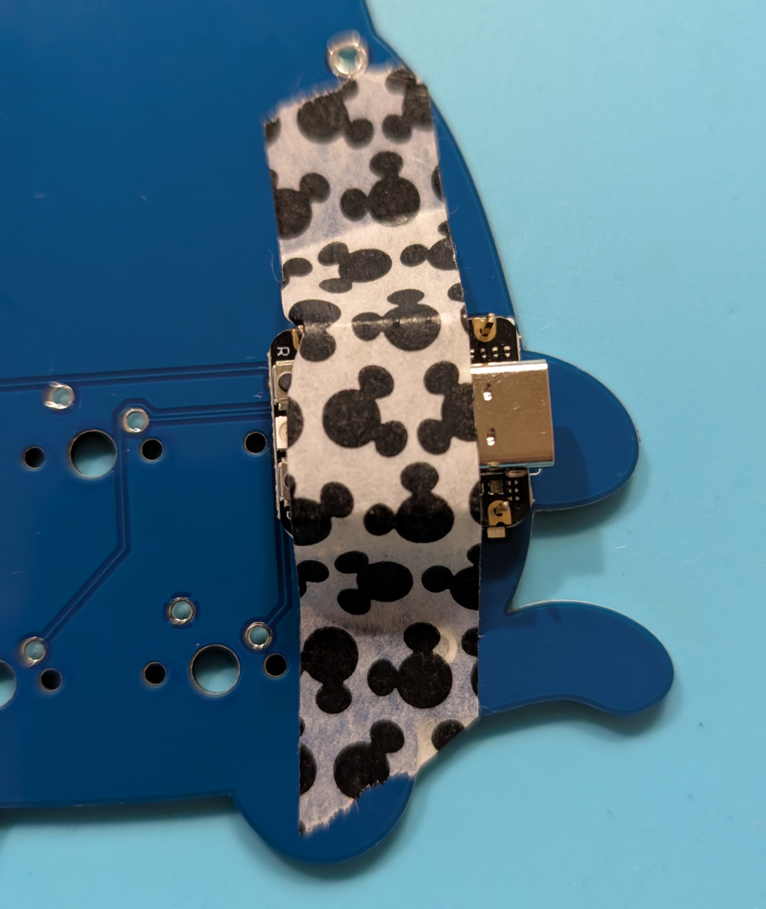
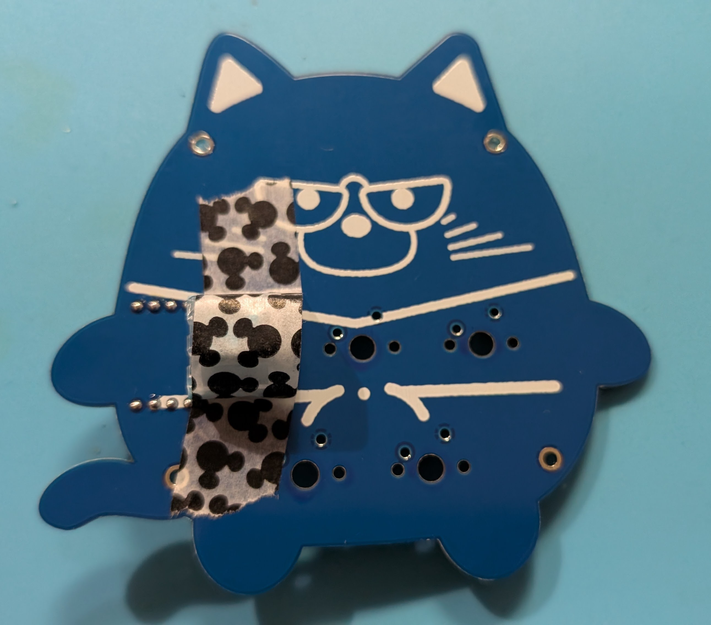
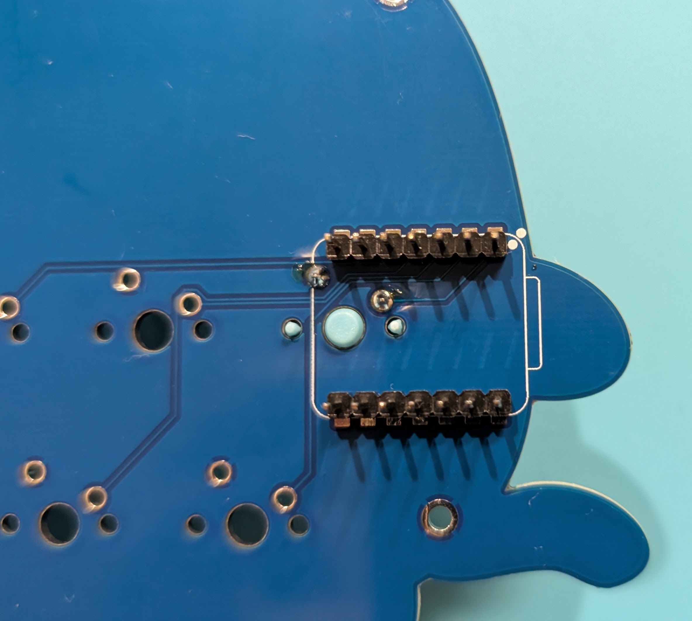
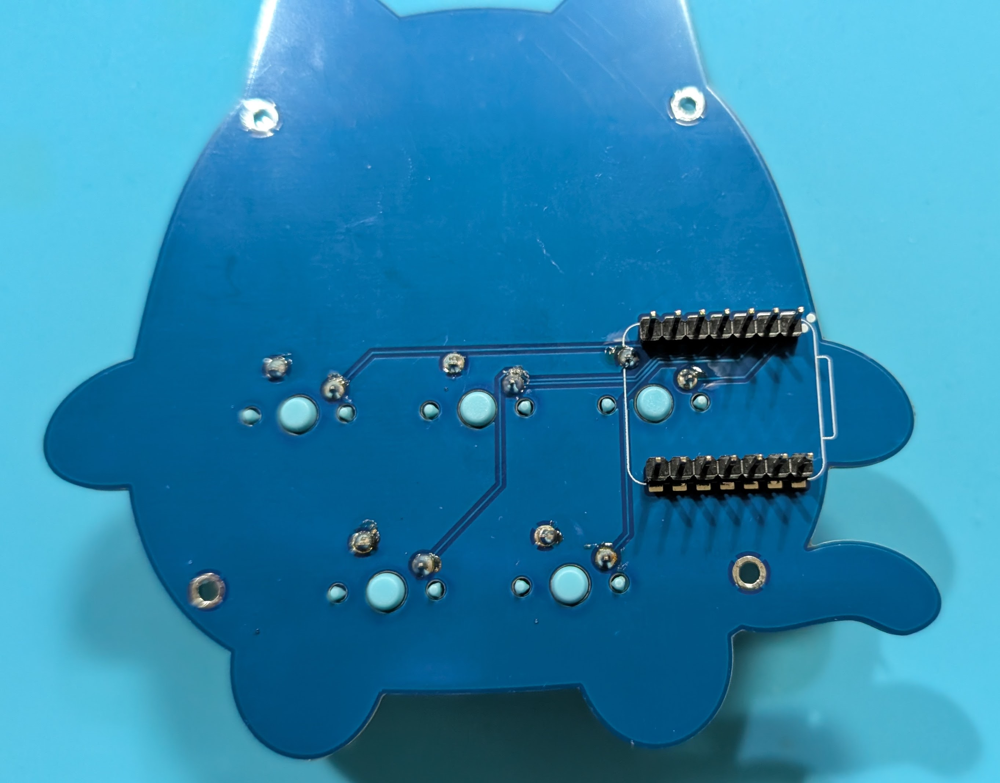
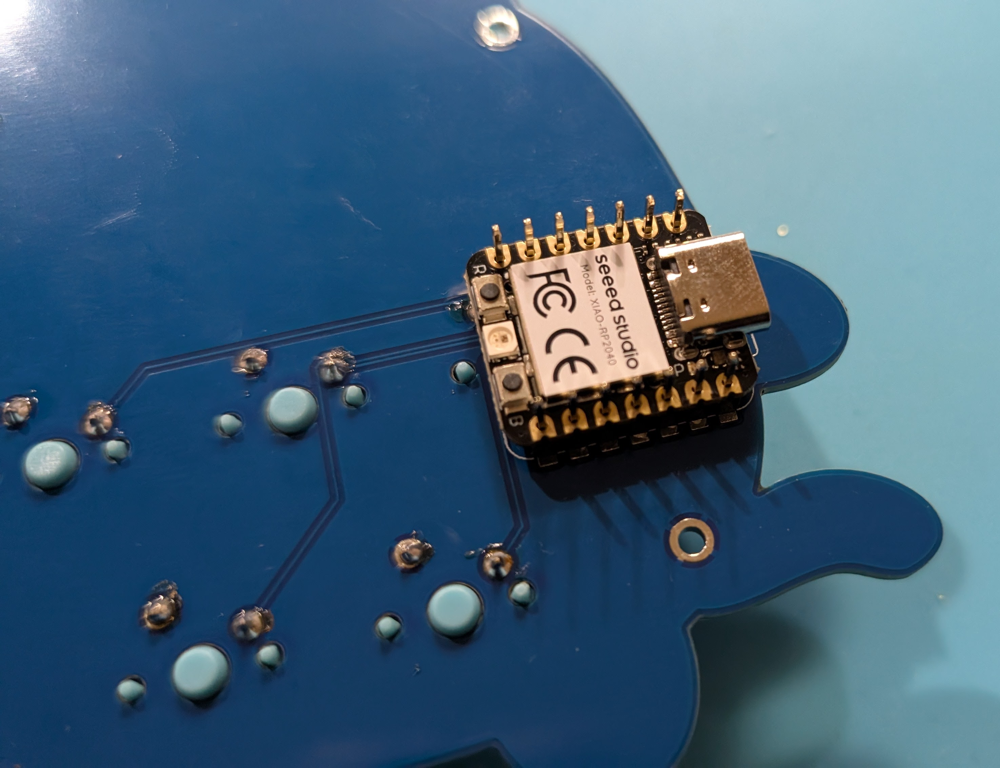
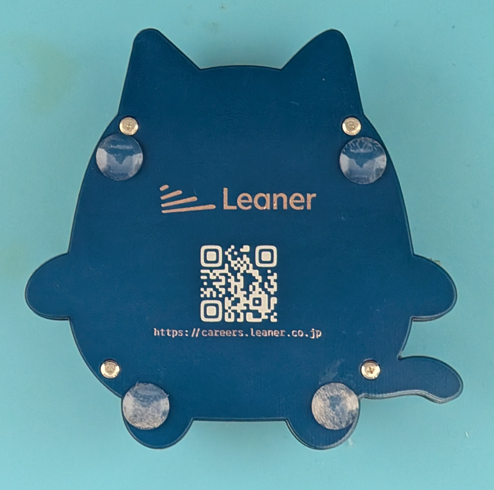

# Leanyer 5keys Build Guide

[日本語ページ](./README_ja.md) (Japanese Page)

## 1. Introduction

### Kit Overview
This build guide explains the assembly procedure for the "Leanyer 5keys v1.0".

### Target Audience
This guide is intended for users with soldering experience.
Soldering is required, and familiarity with basic tools is assumed.

### Notes Before Starting
* Before starting, please read through this entire guide to understand the overall process.
* Carefully check the photos and diagrams in each step, paying close attention to the orientation and position of components.
* Proceed calmly and carefully through each step.

### Disclaimer
* We are not responsible for any damage to components, personal injury, or other losses incurred while assembling the keyboard based on this build guide. Please proceed at your own risk.
* Kit specifications are subject to change without notice. Please also refer to any included instructions and information from the seller.

## 2. Required Items

### Kit Contents
Before starting, please check that you have all the following parts. If anything is missing or damaged, please contact [@phigasui](https://x.com/phigasui).

| Part Name        | Quantity | Notes |
|------------------|:--------:|-------|
| PCB              | 1        |       |
| Bottom Plate     | 1        |       |
| Screws (M2 x 4mm)| 8        |       |
| Spacers (10mm)   | 4        |       |
| Rubber Feet      | 4        |       |

### Required Parts (Not Included)

| Part Name                        | Quantity | Notes |
|:---------------------------------|:--------:|:------|
| Seeed Studio XIAO RP2040 (Microcontroller) | 1        | [Seeed Studio XIAO RP2040 - Seeed Studio](https://www.seeedstudio.com/Seeed-XIAO-RP2040-p-5026.html) |
| Pin Headers (1x7)                | 2        | Pin headers are usually included when purchasing the XIAO RP2040. (You need two 7-pin headers) |
| MX-compatible Key Switches     | 5        | Choose switches with your preferred feel |
| MX-compatible 1U Keycaps       | 5        |       |
| Type-C USB Cable               | 1        | Must support data transfer |

### Required Tools

| Tool Name                     | Notes |
|:------------------------------|:------|
| Phillips Head Precision Screwdriver |       |
| Soldering Iron                | Recommended: [Hakko FX600-02](https://www.amazon.com/dp/B006MQD7M4?th=1) (Link is for Amazon Japan) |
| Solder                        | Recommended: [Goot SD-82 Lead Solder (Sn60/Pb40), Φ0.8mm](https://www.amazon.co.jp/dp/B0C8YXTY9T?th=1) (Link is for Amazon Japan) |
| Soldering Stand & Cleaner   | Recommended: [Hakko 633-01 Stand for FX-600](https://www.amazon.co.jp/dp/B000TGNWCS?th=1) (Link is for Amazon Japan) |
| Masking Tape                  | For temporarily holding parts in place |
| Nippers (Flush Cutters)       | To cut excess legs of pin headers |

### Optional (Nice-to-Have) Tools

| Tool Name                      | Notes                                        |
|:-------------------------------|:---------------------------------------------|
| Keycap Puller                  | For removing keycaps                         |
| Desoldering Wick / Solder Sucker | For correcting soldering mistakes            |
| Multimeter                     | For continuity checks and troubleshooting    |
| Jumper Wires                   | For continuity checks and troubleshooting    |
| Tweezers                       | For handling small components                |

## 3. Assembly Steps

**Important:** Carefully follow the instructions and check the photos for each step.

### Step 1: Microcontroller Check (Recommended)
Replacing the microcontroller after soldering is difficult, so check its operation beforehand.

1.  While holding down the Boot button (marked 'B') on the microcontroller, connect it to your PC. If a volume named `RPI-RP2` mounts successfully, it's working.
2.  Download and unzip the .uf2 file from [PRK Firmware Releases](https://github.com/picoruby/prk_firmware/releases).
3.  Drag and drop the .uf2 file onto the `RPI-RP2` volume. If `RPI-RP2` unmounts and `PRK_FIRMWARE` mounts, it's successful.
4.  Download [keymap.rb](./keymap.rb) and drag and drop it onto the `PRK_FIRMWARE` volume.
5.  Using a jumper wire or tweezers, connect the `GND` and `D0` (or just `0`) pins on the microcontroller.
    
6.  Confirm that a key press is registered on your PC screen.

### Step 2: Soldering Pin Headers

**Important:** If you solder the microcontroller first, you won't be able to install the key switches. **Solder only the pin headers at this stage.**

1.  Insert the pin headers into the PCB. (Insert two 7-pin headers into the designated rows).
    
2.  Place the microcontroller onto the pin headers.
    
3.  Temporarily secure the microcontroller with masking tape.
    
4.  Solder only the four corner pins of the headers (this makes adjustments easier if it's not sitting flat).
    
5.  Remove the microcontroller and check if there is any gap between the pin headers and the PCB. Ensure they are flush.
    
6.  Solder all the remaining pins.
    

* Pin header soldering complete! :tada:
    

### Step 3: Soldering Key Switches
Solder the 5 key switches to the PCB.

1.  Insert a key switch into the PCB. Make sure it sits flat.
    
2.  Temporarily secure the key switch with masking tape.
    
3.  Solder the key switch pins.
    
4.  Repeat the process for the other four key switches.
    

### Step 4: Soldering the Microcontroller
Carefully orient the microcontroller and insert it onto the soldered pin headers, then solder it in place.

1.  Place the microcontroller onto the pin headers, ensuring the orientation is correct (USB port facing outwards).
    
2.  (Optional but recommended) Cover the excess length of the pin header legs with masking tape and trim them with nippers.
    * This prevents the cut pins from flying off.
        
    * Leave this much length on the pins.
        
3.  Solder the microcontroller to the pin headers.
    

### Step 5: Attaching the Bottom Plate
1.  Attach the four spacers to the designated holes on the PCB using four M2 screws from the top side.
    
2.  Place the bottom plate onto the spacers and secure it with the remaining four M2 screws. Finally, attach the rubber feet to the bottom plate.
    

### Step 6: Attaching Keycaps

1.  Align the keycaps with the stems of the corresponding key switches and press them down firmly.
2.  Once all keycaps are attached, the assembly is complete! :tada:

## 4. Firmware Flashing and Configuration

### About the Firmware
This keyboard runs on [PRK Firmware](https://github.com/picoruby/prk_firmware).

### Flashing Method (If Needed)
Follow these steps to update or flash custom firmware:

1.  Prepare the firmware file (`.rb`) you want to flash.
2.  Connect the keyboard to your PC. It should mount as the `PRK_FIRMWARE` volume.
3.  Drag and drop the `.rb` file onto the `PRK_FIRMWARE` volume.
4.  Press the key switches and confirm that key presses are registered on your PC screen.

## 5. Operation Check

Once assembly and firmware setup are complete, perform a final operation check.

1.  Connect the keyboard to your PC.
2.  Open a text editor (like Notepad).
3.  Press each key sequentially and confirm that the intended input is registered.
    * Are there any unresponsive keys?
    * Are any keys registering unintended characters? (Check keymap settings)

## 6. Afterword

Congratulations! Your "Leanyer Keyboard" is now complete! 🎉
Enjoy customizing the keymap to your liking and experiencing a more comfortable keyboard life.

We hope this build guide has been helpful in your keyboard building journey.
