# リーニャー5keys ビルドガイド

[English Page](./README.md)

## 1. はじめに

### キットの紹介
このビルドガイドは「Leanyer(リーニャー) 5keys v1.0」の組み立て手順を解説します。

### 対象読者
このガイドは、はんだ付け経験のある方を対象としています。
はんだ付け作業が必要で、基本的な工具の扱いに慣れていることを前提とします。

### ビルドガイドを読む上での注意
* 作業を始める前に、このガイド全体に目を通し、手順の概要を把握してください。
* 各ステップの写真や図をよく確認し、部品の向きや位置を間違えないように注意深く作業を進めてください。
* 焦らず、一つ一つの工程を丁寧に行いましょう。

### 免責事項
* このビルドガイドに基づいてキーボードを組み立てる際の、部品の破損、怪我、その他の損害について、当方は一切の責任を負いかねます。作業は自己責任でお願いいたします。
* キットの仕様は予告なく変更される場合があります。同梱されている説明書や販売元の情報も合わせてご確認ください。

## 2. 必要なもの

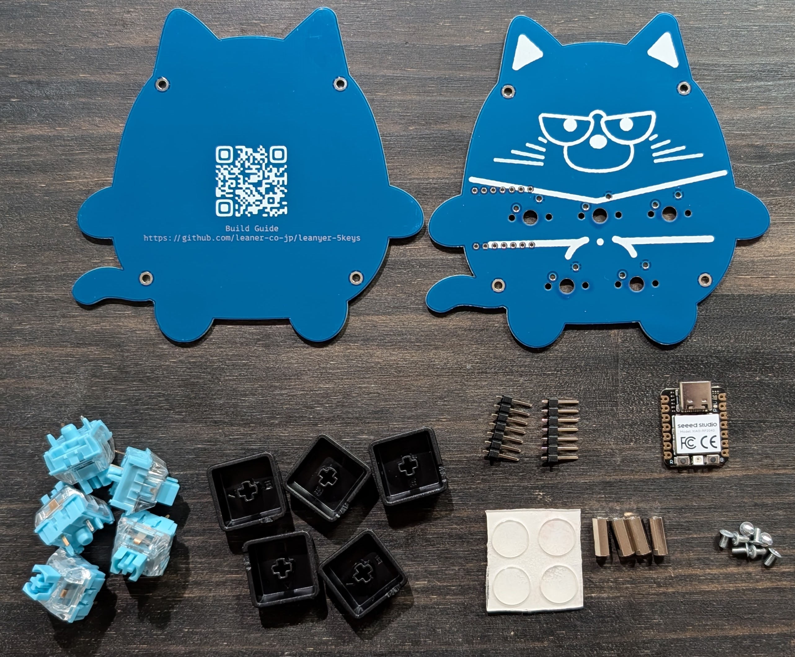

### キット同梱品リスト
作業を始める前に、以下の部品がすべて揃っているか確認してください。不足や破損がある場合は [@phigasui](https://x.com/phigasui) までお問い合わせください。

| 部品名             | 数量    | 備考 |
|--------------------|:-------:|------|
| PCB (基板)         | 1枚     |      |
| ボトムプレート     | 1枚     |      |
| ネジ (M2 x 4mm)    | 8本     |      |
| スペーサー (10mm)  | 4本     |      |
| ゴム足             | 4個     |      |

### 別途用意が必要なもの

| 品名                                | 数量 | 備考|
|:------------------------------------|:-----|:----|
| Seeed Studio XIAO RP2040 (マイコン) | 1個  | [Seeed XIAO RP2040: 開発ツール・ボード 秋月電子通商-電子部品・ネット通販](https://akizukidenshi.com/catalog/g/g117044/) |
| ピンヘッダー (1 x 7)                | 1個  | 上記ページから購入するとピンヘッダーも付属します |
| MX互換 キースイッチ                 | 5個  | 好みの打鍵感のものを選ぶ |
| MX互換 1U キーキャップ              | 5個  |     |
| Type-C USBケーブル                  | 1本  | データ通信可能なもの |

### 必要な工具リスト

| 工具名              | 備考 |
|:--------------------|:-----|
| 精密ドライバー (+)  |      |
| はんだごて          | オススメ: [Amazon | 白光(HAKKO) ダイヤル式温度制御はんだこて FX600-02 | ハンダゴテ](https://www.amazon.co.jp/dp/B006MQD7M4?th=1) |
| はんだ              | オススメ: [Amazon | 太洋電機産業(goot) 精密プリント基板用 鉛入りはんだ φ0.8mm 約4.1m スズ60%/鉛40% ヤニ入り SD-82 日本製 | ハンダゴテパーツ](https://www.amazon.co.jp/dp/B0C8YXTY9T?th=1) |
| こて台 & クリーナー | オススメ: [Amazon | 白光(HAKKO) こて台 FX-600/FX-601/PRESTO/DASH用 633-01 | ハンダゴテパーツ](https://www.amazon.co.jp/dp/B000TGNWCS?th=1) |
| マスキングテープ    | 部品仮止めをする |
| ニッパー            | ピンヘッダーの余分な足をカットする |

### あるとよいもの

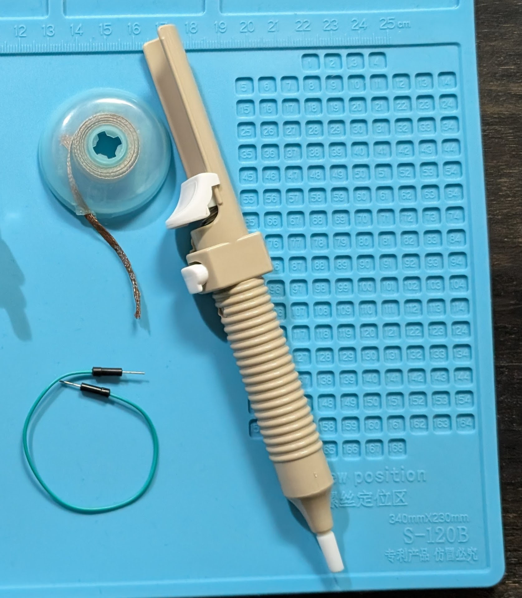

| 工具名              | 備考                                          |
|:--------------------|:----------------------------------------------|
| キーキャッププラー  | キーキャップを取り外しする                    |
| はんだ吸い取り線/器 | はんだ修正用                                  |
| テスター            | 導通チェック、トラブルシューティングに        |
| ジャンパー線        | 導通チェック、トラブルシューティングに        |
| ピンセット          |                                               |

## 3. 組み立て手順

**重要** 各ステップの指示と写真をよく確認し、慎重に作業を進めてください。

### Step 1: (推奨) マイコンの動作確認
マイコンをはんだ付けした後の交換は大変なため、はんだ付けする前に動作確認します。

1. マイコンの Boot ボタン(Bと書いてある側)を押しながら PC と接続します。`RPI-RP2` というボリュームがマウントされればOKです。
2. [PRK Firmware](https://github.com/picoruby/prk_firmware/releases) から.uf2 ファイルをダウンロード&解凍します。
3. .uf2 ファイルを `RPI-RP2` へドラッグ&ドロップします。`RPI-RP2` がアンマウントされ、`PRK_FIRMWARE` がマウントされればOKです。
4. [keymap.rb](./keymap.rb) をダウンロードして `PRK_FIRMWARE` にドラッグ&ドロップします。
5. ジャンパー線かピンセットの先で、マイコンの `GND` と `0` を接続します。
   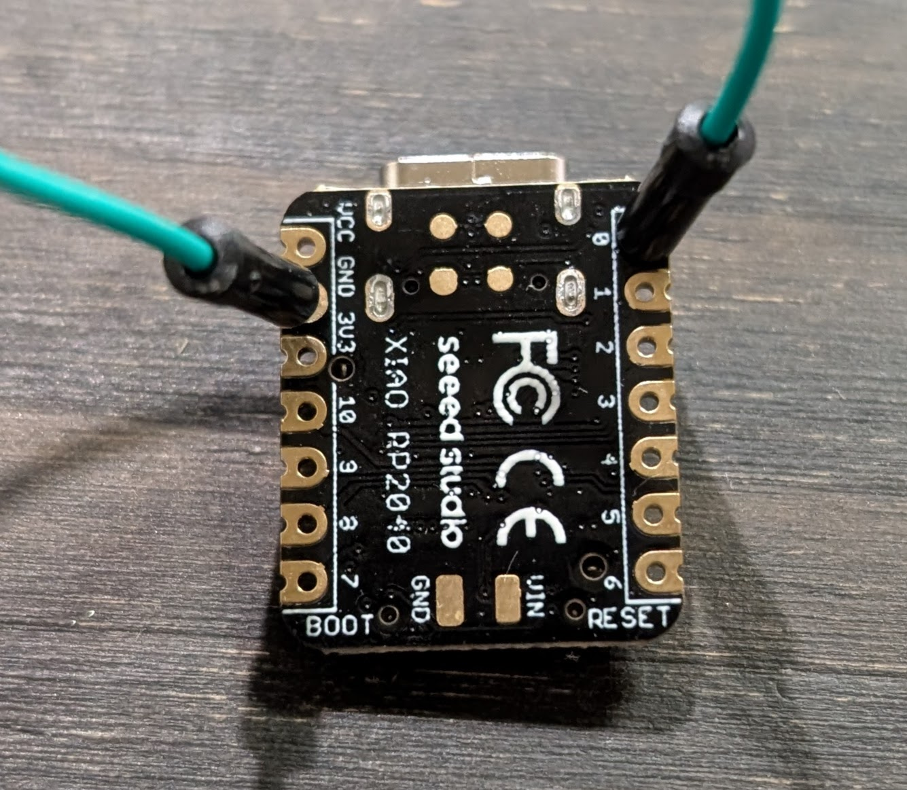
6. PC 画面上でキーが入力されることを確認します。

### Step 2: ピンヘッダーのはんだ付け

**重要** ここで先にマイコンをはんだ付けしてしまうとキースイッチを取り付けられなくなるため **ピンヘッダーのみはんだ付けします。**

1. ピンヘッダーを PCB に差し込む
   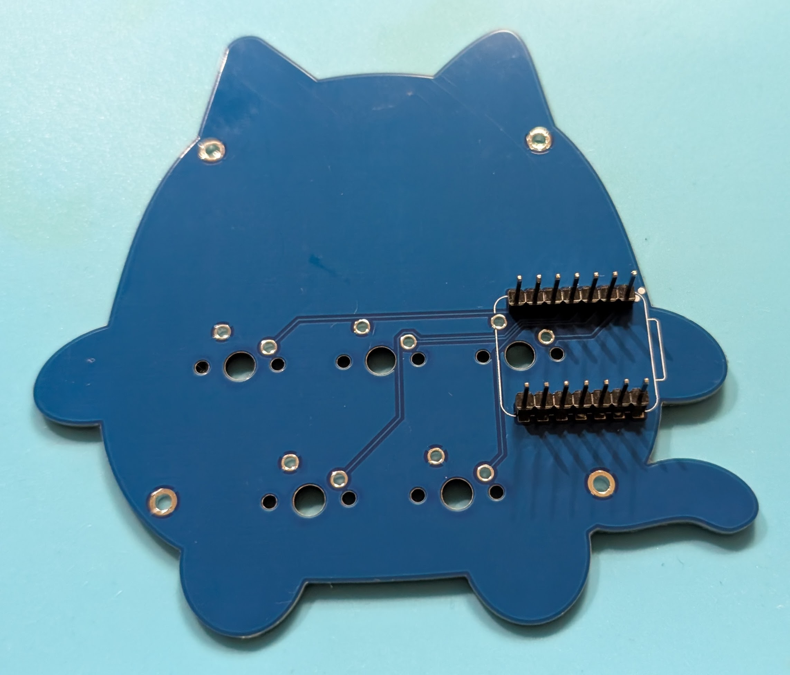
2. マイコンを ピンヘッダーに差し込む
   
3. マイコンをマスキングテープで仮止めする
   
4. ピンヘッダーの端の4ピンだけはんだ付けする(浮いてた時の修正がしやすいように)
   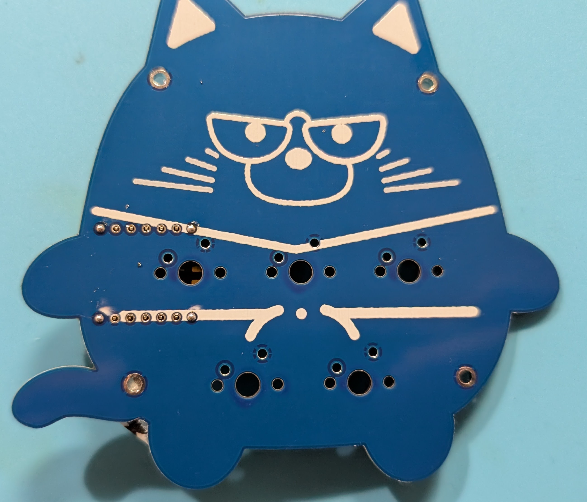
5. マイコンをはずしてピンヘッダーと PCB に隙間がないか確認する
   
6. すべてのピンをはんだ付けする
   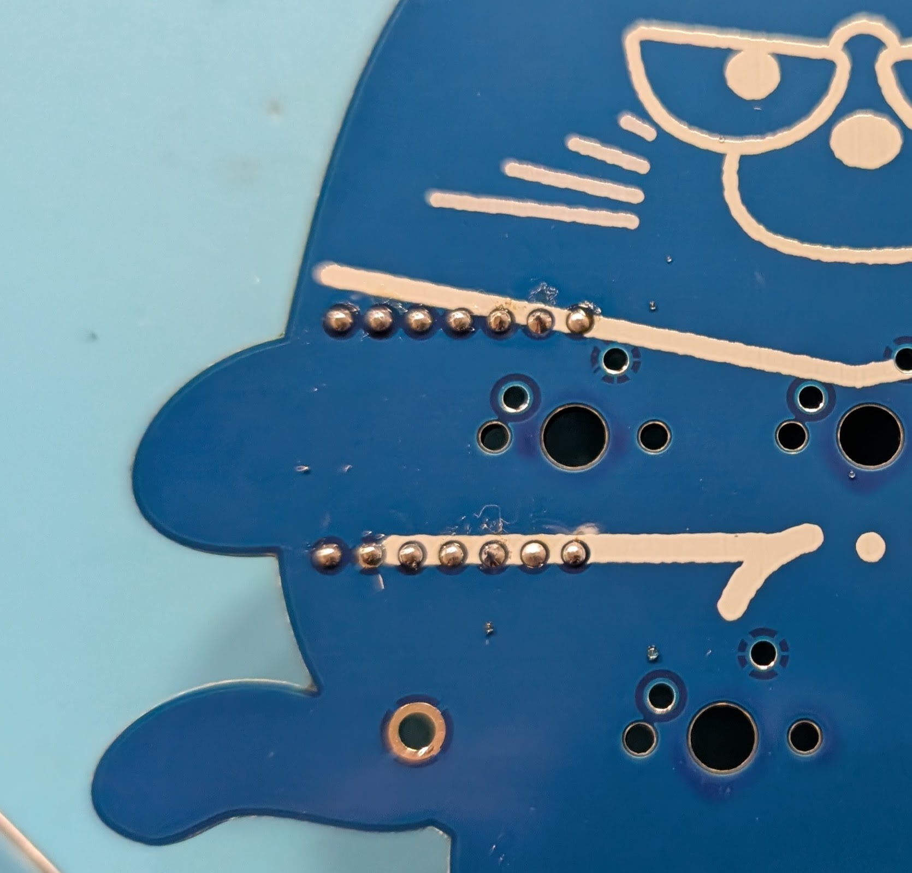

* ピンヘッダーのはんだ付け完了 :tada:
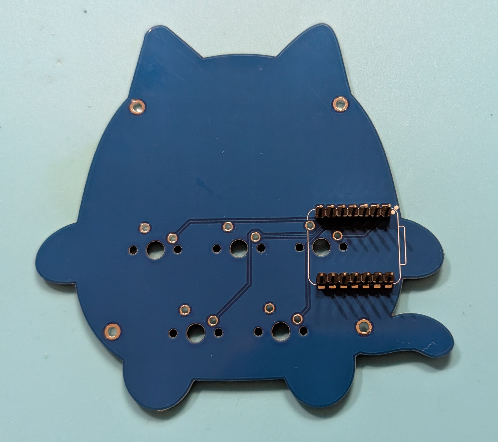

### Step 3: キースイッチのはんだ付け
5つのキースイッチを PCB にはんだ付けします。

1. キースイッチを PCB に差し込む
   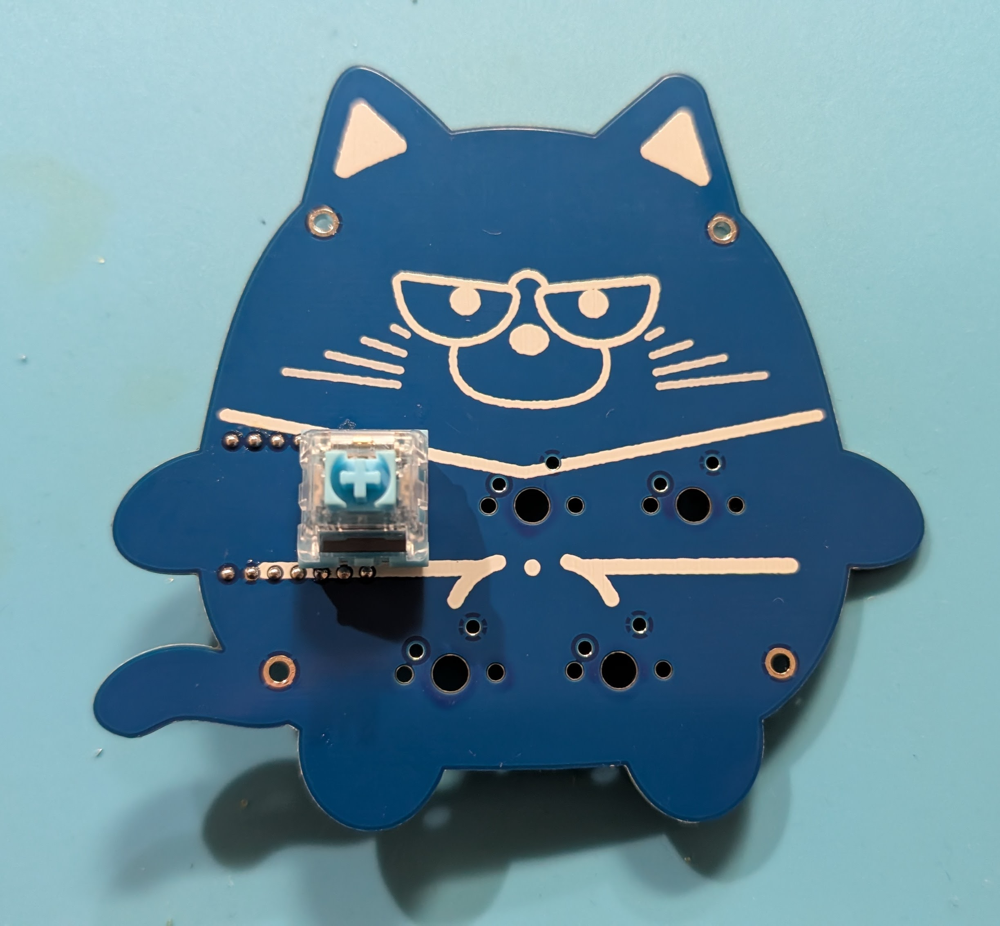
2. キースイッチをマスキングテープで仮止めする
   
3. キースイッチをはんだ付けする
   
4. もう4つのキースイッチを同じ手順ではんだ付けする
   

### Step 4: マイコンのはんだ付け
向きに注意してピンヘッダーに差し込み、はんだ付けします。

1. マイコンをピンヘッダーに差し込む
   
2. ピンヘッダーのピンの余分な部分をマスキングテープで止めてニッパーでカットする
   * カットしたピンが飛び散らないようにする
     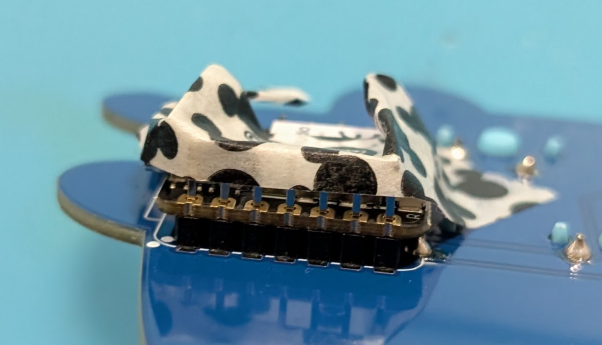
   * 残すピンの長さはこのくらい
     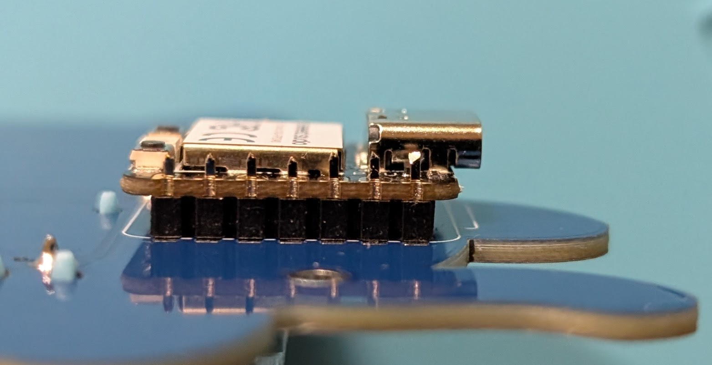
3. マイコンをはんだ付けする
   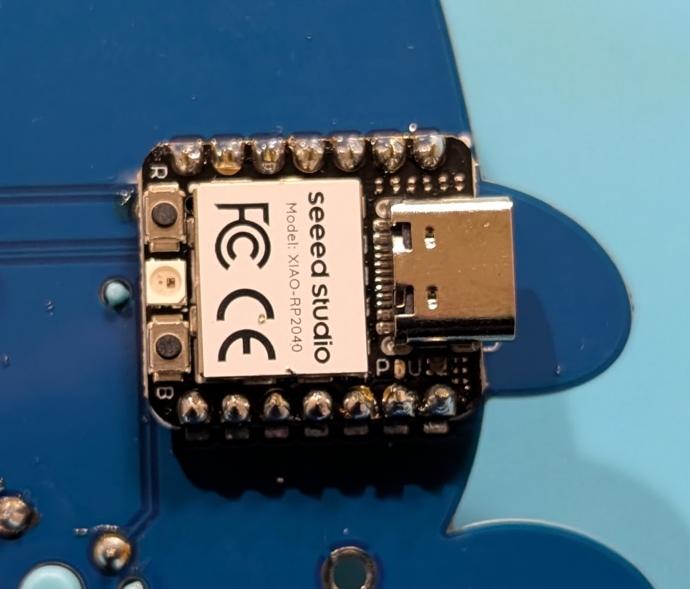

### Step 5: ボトムプレートの取り付け
1. スペーサーをPCB上の指定箇所に取り付けます。（ネジ止めの場合あり）
   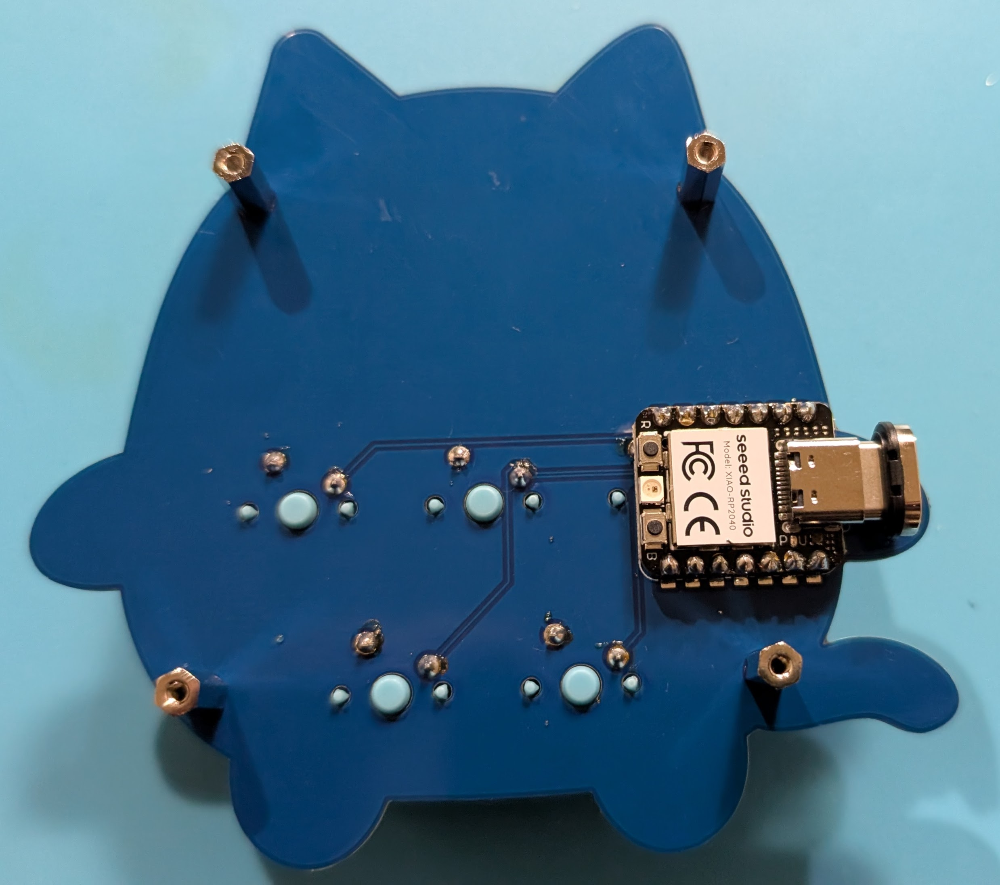
2. ボトムプレートを被せてネジ止めし、最後に、底面にゴム足を貼り付けます。
   

### Step 6: キーキャップの取り付け

1.  キーキャップを対応するキースイッチの軸に、向きを合わせてまっすぐ押し込みます。
2.  すべてのキーキャップを取り付けたら、組み立て完了です:tada:

## 4. ファームウェアの書き込みと設定

### ファームウェアについて
[PRK Firmware](https://github.com/picoruby/prk_firmware) で動作します。

### 書き込み方法 (必要な場合)
ファームウェアを更新したり、カスタムファームウェアを書き込んだりする場合は、以下の手順で行います。（キットによって手順は異なります）

1. 書き込みたいファームウェアファイル(`.rb`)を用意します。
2. キーボードをPCに接続し、 `PRK_FIRMWARE` のボリュームにドラッグ&ドロップします。
3. キースイッチを押して PC 画面上にキーが入力されることを確認します。

## 5. 動作確認

組み立てとファームウェアの準備ができたら、最終的な動作確認を行います。

1. キーボードをPCに接続します。
2. メモ帳などを開きます。
3. すべてのキーを順番に押し、意図した通りに入力されるか確認します。
    * 反応しないキーはないか？
    * 意図しない文字が入力されるキーはないか？ (キーマップ設定を確認)

## 6. あとがき

おめでとうございます！これであなたの「リーニャーキーボード」が完成しました！🎉
キーマップを自分好みにカスタマイズして、さらに快適なキーボードライフを楽しんでください。

このビルドガイドが、あなたのキーボード製作の一助となれば幸いです。
